# Hi, I'm Neeraj Gupta 👋

### Full-Stack Web Developer • AI/ML Enthusiast • Final Year Computer Science Student

 

---

## 👨‍💻 About Me

I'm a **Computer Science student and Full-Stack Web Developer** interested in building practical and user-friendly web applications.

I work with modern web technologies and enjoy turning ideas into functional projects. Alongside web development, I'm exploring **Artificial Intelligence and Machine Learning** and continuously improving my programming and problem-solving skills.

- 💻 Full-Stack Web Development
- 🤖 Exploring AI & Machine Learning
- 🐍 Python Development
- 🌐 Responsive Web Applications
- 🔐 Authentication & Database Integration
- 🚀 Learning by building real projects

---

## 🛠️ Tech Stack

### 💻 Programming & Web

### 🗄️ Database & Backend

### 🔧 Tools & Platforms

---

# 🚀 Featured Projects

## 🌟 SkillBright

A web platform focused on connecting people through skills and learning opportunities.

**Highlights:**
- User authentication
- User profiles
- Skill-based interaction
- Responsive interface
- Web-based platform

**Live Project:**  
👉 https://skillbright.akash43gupta2.workers.dev

---

## 💻 Neeraj Portfolio

My personal developer portfolio showcasing my projects, technical skills, experience and learning journey.

**Built with:**
`React.js` • `JavaScript` • `HTML` • `CSS`

**Live Portfolio:**  
👉 https://neeraj-portfolio-six-virid.vercel.app/

---

## 📚 Kusīnārā – International Journal of Pāli & Indic Studies

A collaborative web platform created for **Kusīnārā – An International Journal of Pāli & Indic Studies**.

The platform provides an online presence for the journal and supports its digital publication and communication needs.

**Technologies:**  
`React.js` • `Vite` • `CSS` • `Web3Forms` • `Node.js`

**Live Website:**  
👉 https://www.kusinara.org

---

# 📊 GitHub Statistics

  

---

# 📈 Contribution Activity

  

---

# 🏆 GitHub Highlights

---

# 💼 Experience

### Full Stack Development Intern
**SaiKet Systems**

Worked on practical web development tasks and improved my understanding of building responsive web applications.

### Full Stack Development Intern
**Cognifyz IT Solutions**

Gained practical exposure to web development through internship-based projects and technical tasks.

### Student Ambassador
**Syntro Tech**

Participated in student outreach, communication and technology-related engagement activities.

---

# 📚 Currently Learning

- 🤖 Artificial Intelligence
- 🧠 Machine Learning
- 🐍 Python
- 🌐 Full-Stack Web Development
- 🗄️ Database Management
- 💡 Data Structures & Algorithms

---

# 🎯 Goals

My current focus is to:

- Build more practical full-stack applications
- Strengthen my Python and AI/ML skills
- Improve problem-solving and DSA
- Work on meaningful real-world projects
- Continue learning modern technologies

---

## 🤝 Let's Connect

I'm always interested in learning, building projects and connecting with other developers.

  

  

### ⭐ Thanks for visiting my profile!

